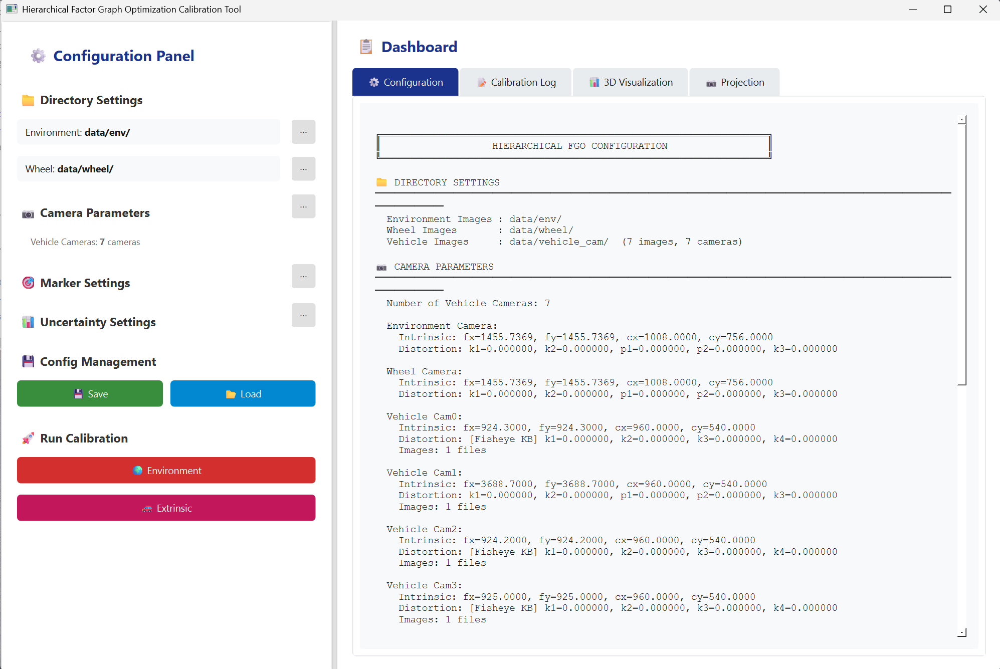
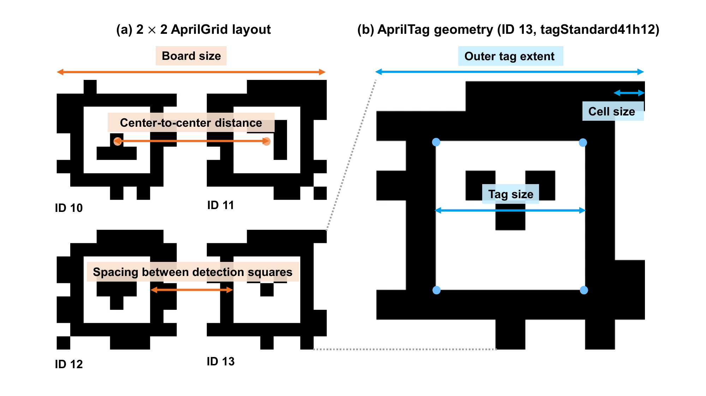

# Hierarchical Factor Graph Optimization Calibration Tool

A camera extrinsic calibration system based on Hierarchical Factor Graph
Optimization (FGO) with a PySide6 GUI.  
Optimization runs in three stages — environment markers, wheel markers, then
vehicle cameras — and each stage weights its factors with MARSCOT uncertainty.



---

## 📁 Project Structure

```
hierarchical_fgo/
│
├── calibration_tool.py              # Main GUI entry point (PySide6)
├── fgo_system.py                    # Core factor graph optimization logic
├── pose_covariance_calculator.py    # MARSCOT pose uncertainty
├── Harris_matrix_extractor.py       # Harris matrix extraction
├── main.py                          # CLI entry point
├── requirements.txt                 # Python package dependencies
├── ARCHITECTURE.md                  # System architecture notes
├── GUIDE.md                         # Detailed usage guide
│
└── src/
    ├── config.py                    # All configuration (CalibrationConfig)
    └── calibration.py               # Calibration runner (CalibrationSystem)
```

---

## 🚀 Quick Start

### 0. Requirements

| Item | Version |
|------|---------|
| Python | **3.11** (developed and tested); 3.9 – 3.12 expected to work but untested |
| OS | Windows / Linux / macOS |

> Python 3.13 and newer are not supported: the pinned `numpy>=1.21.0,<2.0.0`
> tops out at numpy 1.26.x, which publishes no 3.13 wheels.

```bash
conda create -n hierarchical_fgo python=3.11
conda activate hierarchical_fgo
```

### 1. Install dependencies

```bash
pip install -r requirements.txt
```

> **Installing GTSAM (conda recommended):**
> ```bash
> conda install -c conda-forge gtsam
> ```

### 2. Run the GUI

```bash
cd hierarchical_fgo
python calibration_tool.py
```

### 3. Run from the CLI

```bash
cd hierarchical_fgo
python main.py
```

---

## 🔄 Three-Stage Optimization Pipeline

```
[Stage 1] Environment Marker Optimization
    ↓  AprilTag images captured by the environment camera
    ↓  Marker detection → MARSCOT uncertainty → factor graph construction
    ↓  min_pair_obs filter drops rarely co-observed marker pairs, then LM
    ↓  Result: absolute poses of the marker nodes (saved to optimization_results.pkl)
    ↓  Auto popup: per-marker 6DoF pose table (relative to the reference marker)

[Stage 2] Wheel Marker Optimization
    ↓  Vehicle marker images captured by the wheel camera
    ↓  Stage 1 result plus the wheel marker observation factors
    ↓  min_pair_obs filter, then LM
    ↓  Result: combined environment + wheel marker poses
    ↓  Auto popup: per-marker 6DoF pose table (relative to the reference marker)

[Stage 3] Vehicle Camera Optimization
    ↓  Images captured by the vehicle cameras (fisheye / pinhole)
    ↓  Vehicle camera nodes added on top of the frozen Stage 2 result
    ↓  geo_skip consistency filter drops outlier observations, then LM
    ↓  Result: camera extrinsics in the vehicle frame (6DoF)
    ↓  Export: [x, y, z, roll, pitch, yaw] plus the 4x4 transformation matrix
```

---

## 📋 GUI Workflow

| Step | Item | Description |
|------|------|-------------|
| 1 | **Environment Image Directory** | Select the folder of environment marker (AprilTag) images |
| 2 | **Wheel Image Directory** | Select the folder of vehicle wheel marker images |
| 3 | **Camera Parameters** | Enter fx, fy, cx, cy, k1, k2, k3, p1, p2 |
| 4 | **🎯 Marker Settings** | Marker size, reference marker ID, vehicle marker board IDs, excluded board IDs, tag family, board grid (rows x cols, gap) — in the Marker & AprilTag Configuration dialog |
| 5 | **📊 Uncertainty Settings** | See [Configuration Reference](#-configuration-reference) below |
| 6 | **🌍 Environment** | Run Stage 1; the marker pose window pops up when it finishes |
| 7 | **🚗 Extrinsic** | Load Stage 1, then run Stage 2 and Stage 3 |
| 8 | **Export Poses** | Save the vehicle camera poses (.txt / .json / .yaml — falls back to JSON when PyYAML is absent) |

---

## 🎯 Marker Board Geometry



Both the environment and the wheel targets are **2 x 2 AprilGrid boards** of the
`tagStandard41h12` family. That family draws a reversed border, so the square the
detector reports as the tag corners (`width_at_border` = 5 cells) sits *inside*
the full printed pattern (`total_width` = 9 cells) — panel (b).

> **`marker_size` holds a half-length.** `CalibrationConfig.marker_size` and
> `marker_size2` store **half** the side of the detection square, not the whole
> side and not the outer printed extent. `tag_gap` is measured between the
> detection squares of neighbouring tags, as drawn in panel (a).

Values as configured for the simulation, in meters:

| Figure label | Derived from | Environment board | Wheel board |
|--------------|--------------|------------------:|------------:|
| Tag size (detection square) | `2 x marker_size` / `2 x marker_size2` | 0.197531 | 0.123457 |
| Cell size | tag size / `width_at_border` (5) | 0.039506 | 0.024691 |
| Outer tag extent | cell size x `total_width` (9) | 0.355556 | 0.222222 |
| Spacing between detection squares | `env_tag_gap` / `wheel_tag_gap` | 0.246914 | 0.154321 |
| Center-to-center distance | tag size + spacing | 0.444445 | 0.277778 |
| **Board size** | center-to-center + outer tag extent | **0.800000** | **0.500000** |

The board sizes are the quantities that were actually set in the simulator
(0.8 m and 0.5 m); every other row above is a consequence of them. The stored
`tag_gap` values are rounded to six decimals, which is why the board size
reproduces as 0.8000004 rather than exactly 0.8.

Board and tag ID assignment:

| Item | Config field | Value |
|------|--------------|-------|
| Tag family | `apriltag_family` | `tagStandard41h12` |
| Board grid | `env_grid_rows` x `env_grid_cols` | 2 x 2 (wheel boards likewise) |
| First environment board | `env_first_tag_id` | `10` (IDs 10–13, as drawn in panel (a)) |
| World-origin board | `first_marker_id` | `10` |
| Wheel board IDs [fl, rl, rr, fr] | `vehicle_markers` | `[74, 78, 86, 82]` |

A board's ID is the smallest tag ID printed on it, and tags fill the grid
row-major from the top-left slot.

---

## ⚙ Configuration Reference

Every observation's 6x6 pose covariance is computed with MARSCOT (unscented
transform through PnP) and handed to GTSAM unchanged. There is no alternative
covariance model to select, so the **📊 Uncertainty Settings** dialog exposes
only the observation filters below.

| Parameter | Description | Default |
|-----------|-------------|---------|
| `geo_skip_rot_deg` | Stage 3 rotation threshold for vehicle observation consistency [deg] | `4.0` |
| `geo_skip_pos_m` | Stage 3 position threshold for vehicle observation consistency [m] | `0.1` |
| `min_pair_obs` | Minimum co-observation count for a marker pair — pairs below it are removed, `1` disables the filter (Stages 1 and 2) | `2` |

---

## 📤 Output

### Marker pose auto popup (after Stage 1 / Stage 2)
- Shows the 6DoF poses relative to the reference marker
- Drag-select the numeric area and press Ctrl+C to copy
- A bulk copy button produces Excel-compatible tab-separated text

### Export Poses (vehicle cameras)
Choose the output format: `.txt` / `.json` / `.yaml`

```
[x, y, z, roll, pitch, yaw]: [0.5231, 0.0124, -0.2345, 0.376, -1.044, 0.071]  (m, deg)
4x4 Transformation Matrix:
  [ 0.999832,  0.001234, -0.018234,  0.523100]
  [-0.001452,  0.999978, -0.006543,  0.012400]
  ...
```

---

## 🐛 Troubleshooting

| Symptom | Fix |
|---------|-----|
| `ImportError` | Check that you launched from inside the `hierarchical_fgo/` folder |
| `gtsam` install failure | `conda install -c conda-forge gtsam` |
| No markers detected | Check the image paths, marker size, and marker ID settings |
| Stage 1 popup does not appear | Wait a few seconds after the optimization finishes (it runs on a worker thread) |
| Vehicle camera parameter error | Set the intrinsics for every camera in the Camera Parameters dialog |

---

## 📝 Notes

1. **Working directory**: always launch from inside the `hierarchical_fgo/` folder.
2. **Stage order**: run Stage 1 first, then Stage 2, then Stage 3. The order cannot be changed.
3. **Vehicle camera parameters**: before running Stage 3, set the intrinsics of every camera in the Camera Parameters dialog.
4. **Saved results**: `optimization_results.pkl` is written automatically when Stage 1 finishes, and Stages 2 and 3 build on it.
